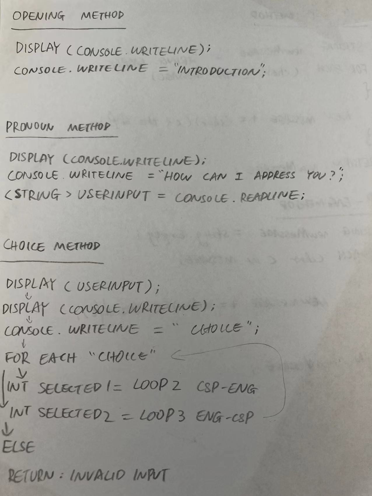
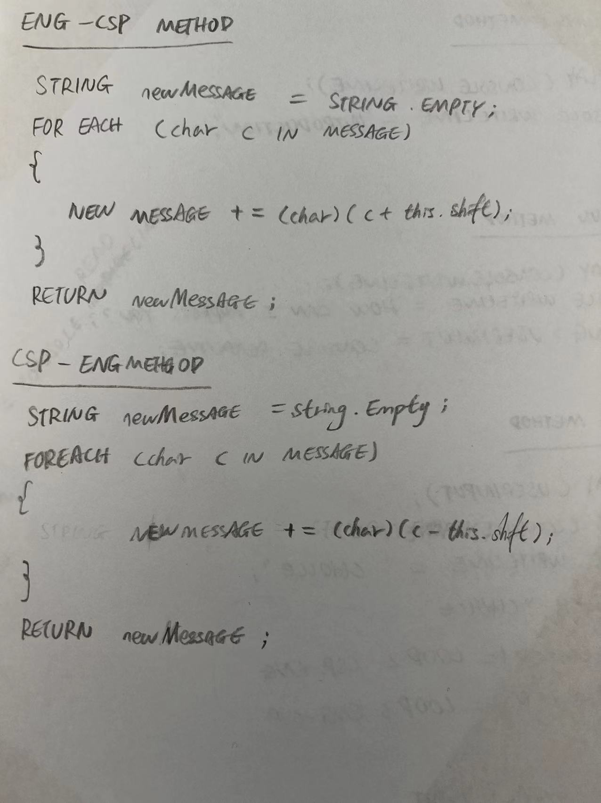
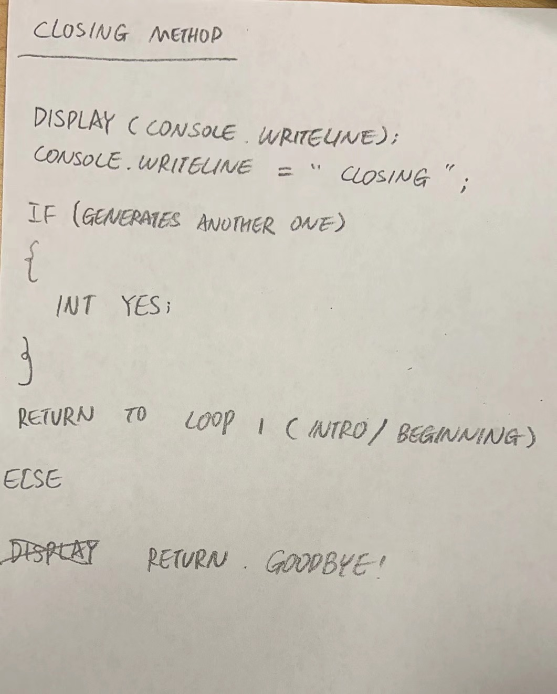

# Extend the Cipher assignment to use a dictionary to determine the correct message

## Description

This Cipher assignment will help you write your secret messages in a cipher code.  No else person will be able to read what you mean unless they can communicate with a computer!

## Purpose

The purpose of this Cipher assignment is to provide entertainment to the user.  The purpose can translate computer languages to english, and also interpret english to computer languages. 

## High Level Design

At a high level, the Cipher assignment works in the following way:

1. Create a question asking the user's name

2. Determine which translate direction is going to be used, goes into second loop:ENG-CS or third loop: CS-ENG.

3. Create a ENG-CS cipher method
   1. Ask for user input
   2. Generate
   3. Display output

4. Create a CS-ENG cipher method
   1. Ask for user input
   2. Generate
   3. Display output

5. Ask the user whatever they want to do another one, loop back

## Flowchart

## Methods

static string OpeningQuestion(Question);

### Opening method

1. Display introduction.

### Pronoun method

1. Display question "How to address the user?".
2. Store the user input inside a string.

### Choice method

1. Display text with user input.
2. Shows a for each loop allowing the user to select between loop 2 and loop 3.
3. If the user didn't pick a choice, return invalided input.
4. Bring the user into the room they just selected.

### English-ComputerLanguage method

string newMessage = string.empty;
foreach(char c in message)
{
   new message += (char)(c + this.shift);
}
return newMessage;

#### Input method

Console.WriteLine = "Input the text that you want to translate:";
Text = Console.ReadLine;

#### DisplayResult method

Display computer language.
result = newMessage;

### ComputerLanguage-English method

string newMessage = string.empty;
foreach(char c in message)
{
   new message += (char)(c - this.shift);
}
return newMessage;

#### Input method

Console.WriteLine = "Input the information that you want to translate:";
Information = Console.ReadLine;

#### DisplayResult method

Display computer language.
result = newMessage;

### Closing method

1. Display closing.
2. Shows a question asking if the user wants to generate another one.
3. If yes, loop back to intro where the entire process starts again.
4. Else, return goodbye.