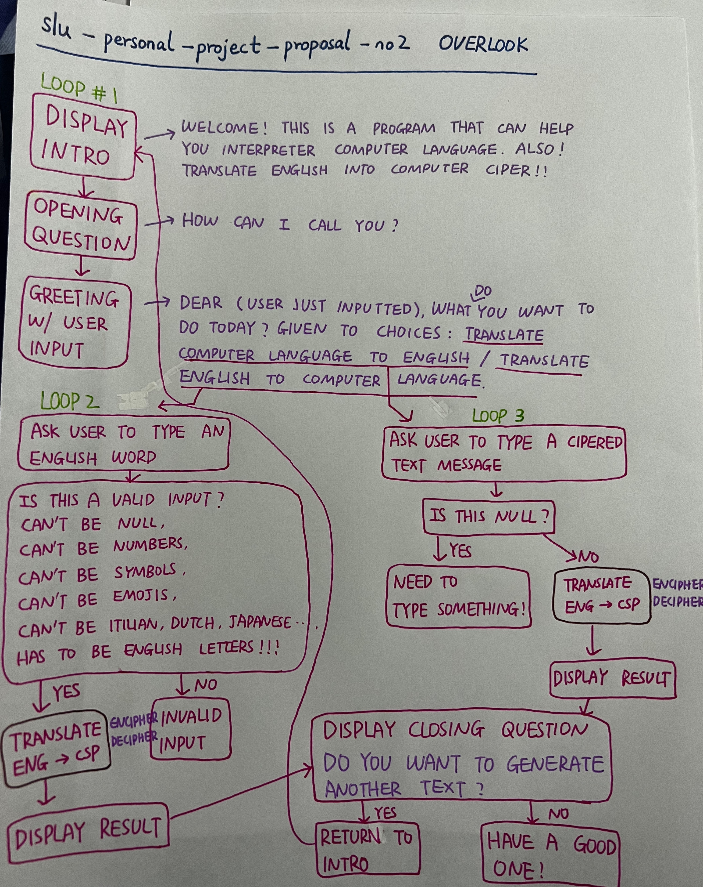

# Extend the Cipher assignment to use a dictionary to determine the correct message

## Description

This Cipher assignment will help you write your secret messages in a cipher code.  No else person will be able to read what you mean unless they can communicate with a computer!

## Purpose

The purpose of this Cipher assignment is to provide entertainment to the user.  The purpose can translate computer languages to english, and also interpret english to computer languages. 

## High Level Design

At a high level, the Cipher assignment works in the following way:

1. Create a question asking the user's name

2. Determine which translate direction is going to be used, goes into second loop:ENG-CS or third loop: CS-ENG.

3. Create a ENG-CS cipher method
   1. Ask for user input
   2. Generate
   3. Display output

4. Create a CS-ENG cipher method
   1. Ask for user input
   2. Generate
   3. Display output

5. Ask the user whatever they want to do another one, loop back

## Flowchart

## Methods

static string OpeningQuestion(Question);

### Opening method

Display introduction, then jump to pronoun class.

### Pronoun method

Ask the user how to address them, then use the user input to ask choice question.

### Choice method

letting the user jump to ENG-CS or CS-ENG.

### English-ComputerLanguage method

#### Input method

Has to be valid English.

#### Encipher method

#### Decipher method

#### DisplayResult method

Display computer language.

### ComputerLanguage-English method

#### Input method

Can't be null.

#### Encipher method

#### Decipher method

#### DisplayResult method

Display English.

### Closing method

Display question if wants to do another one, loops back or says goodbye.